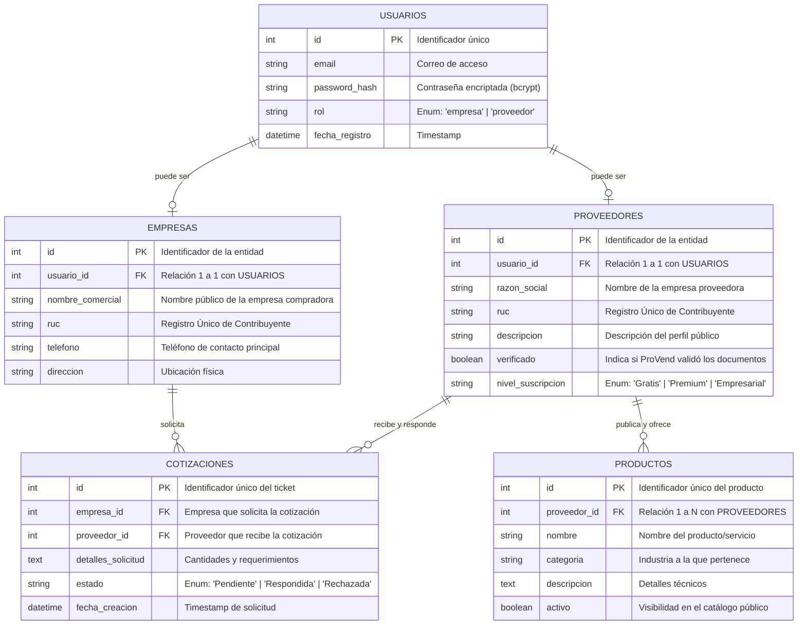

# Diagrama de Base de Datos - ProVend (Modelo Entidad-Relación)

Este documento detalla la estructura lógica de la base de datos relacional (SQL) diseñada para la plataforma B2B ProVend. La arquitectura está normalizada para asegurar integridad de datos, escalabilidad y un manejo eficiente de las interacciones entre empresas compradoras y proveedores.

## 📊 Diagrama ERD (Entity-Relationship Diagram)

El siguiente diagrama ilustra cómo se relacionan las entidades principales de la plataforma. (GitHub renderiza este diagrama automáticamente).

---

## 📝 Diccionario de Datos (Explicación de Entidades)

### 1. Entidad `USUARIOS`
Es la tabla núcleo para la **Autenticación (Login)**. Contiene las credenciales de acceso de cualquier individuo que se registre en la plataforma. Posee un atributo vital llamado `rol` que define si la persona interactuará en el sistema como una Empresa (Comprador) o como un Proveedor. Esto asegura que la autenticación esté centralizada.

### 2. Entidad `EMPRESAS`
Maneja el perfil de las compañías compradoras. Su llave foránea (`usuario_id`) la enlaza directamente a las credenciales de un usuario. Aquí se guardan los datos fiscales y de facturación.

### 3. Entidad `PROVEEDORES`
Controla el perfil público de los ofertantes B2B. A diferencia de las empresas normales, los proveedores cuentan con atributos extra de negocio, como el `nivel_suscripcion` (para los planes de monetización de la plataforma) y una insignia de `verificado` para generar confianza a los compradores.

### 4. Entidad `PRODUCTOS`
Constituye el **Catálogo Virtual**. Un proveedor puede tener múltiples productos (Relación 1 a Muchos). Contiene la información técnica que las empresas utilizarán al buscar en la pestaña "Explorar".

### 5. Entidad `COTIZACIONES`
Es la tabla **Transaccional (El corazón del negocio B2B)**. Es una tabla de rompimiento o de vinculación que conecta a una Empresa con un Proveedor específico. Registra el estado de la negociación (`Pendiente`, `Respondida`) y el mensaje detallado de lo que requiere el comprador. 

---
*Diseño Arquitectónico de Base de Datos para despliegue en entornos SQL (PostgreSQL / MySQL).*
