# Diagrama de Base de Datos ProVend (Actualizado)

A continuación te presento el esquema exacto y actualizado de tu base de datos `database.sqlite`, construido a partir de las tablas que están siendo usadas por el servidor actualmente.

```mermaid
erDiagram
    %% Tablas Principales
    usuarios {
        INTEGER id PK
        TEXT nombre
        TEXT email "UNIQUE"
        TEXT password
        TEXT rol
        TEXT company
        TEXT reset_token
        DATETIME reset_token_expiry
        INTEGER activo "DEFAULT 1"
        DATETIME ultimo_login
    }

    perfiles_proveedor {
        INTEGER id PK
        INTEGER usuario_id FK "UNIQUE"
        TEXT logo_url
        TEXT descripcion
        TEXT ciudad
        TEXT categoria
        TEXT ruc
        TEXT telefono
        TEXT whatsapp
        TEXT sitio_web
        TEXT horario
        TEXT cobertura
        INTEGER verificado "DEFAULT 0"
        TEXT nivel_verificacion "DEFAULT 'Básico'"
        TEXT tiempo_respuesta "DEFAULT '24 horas'"
        TEXT estado "DEFAULT 'Disponible'"
        DATETIME created_at
        TEXT capacidad_mensual_toneladas
        INTEGER tiene_transporte "DEFAULT 0"
    }

    perfiles_empresa {
        INTEGER id PK
        INTEGER usuario_id FK "UNIQUE"
        TEXT logo_url
        TEXT rubro_industria
        TEXT ciudad_operacion
        TEXT telefono_contacto
        TEXT tamano_empresa
        TEXT sitio_web
        TEXT descripcion
        DATETIME created_at
    }

    %% Datos Operativos
    materiales {
        INTEGER id PK
        INTEGER proveedor_id FK
        TEXT nombre
        TEXT cantidad
        TEXT unidad
        TEXT descripcion
        TEXT imagen_url
        TEXT estado "DEFAULT 'Activo'"
        TEXT precio_estimado
        TEXT frecuencia_disponibilidad
        TEXT calidad_pureza
        TEXT volumen_minimo
        INTEGER vistas "DEFAULT 0"
        DATETIME created_at
    }

    productos {
        INTEGER id PK
        INTEGER proveedor_id FK
        TEXT nombre
        TEXT precio
        TEXT categoria
        TEXT descripcion
        TEXT imagen_url
        TEXT estado "DEFAULT 'Activo'"
        DATETIME created_at
    }

    requerimientos {
        INTEGER id PK
        INTEGER empresa_id FK
        TEXT titulo
        TEXT cantidad
        TEXT unidad
        TEXT urgencia
        TEXT descripcion
        TEXT estado "DEFAULT 'Activo'"
        DATETIME created_at
        DATETIME updated_at
    }

    %% Relacionales y Métricas
    visitas {
        INTEGER id PK
        INTEGER proveedor_id FK
        INTEGER visitante_id FK
        TEXT ip_hash
        DATETIME created_at
    }

    favoritos {
        INTEGER id PK
        INTEGER empresa_id FK
        INTEGER proveedor_id FK
        DATETIME created_at
    }

    resenas {
        INTEGER id PK
        INTEGER proveedor_id FK
        INTEGER empresa_id FK
        INTEGER rating
        TEXT comentario
        DATETIME created_at
    }

    notificaciones {
        INTEGER id PK
        INTEGER usuario_id FK
        TEXT tipo
        TEXT mensaje
        INTEGER leida "DEFAULT 0"
        DATETIME created_at
    }

    %% Relaciones
    usuarios ||--o| perfiles_proveedor : "Tiene Perfil Proveedor"
    usuarios ||--o| perfiles_empresa : "Tiene Perfil Empresa"
    
    usuarios ||--o{ materiales : "Publica (como proveedor)"
    usuarios ||--o{ productos : "Vende (como proveedor)"
    usuarios ||--o{ requerimientos : "Solicita (como empresa)"
    
    usuarios ||--o{ notificaciones : "Recibe"
    
    usuarios ||--o{ visitas : "Recibe visitas en perfil"
    usuarios ||--o{ visitas : "Visita a otros"
    
    usuarios ||--o{ favoritos : "Guarda (como empresa)"
    usuarios ||--o{ favoritos : "Es guardado (como proveedor)"
    
    usuarios ||--o{ resenas : "Recibe (como proveedor)"
    usuarios ||--o{ resenas : "Escribe (como empresa)"
```

### Principales Cambios y Estructura Actual:
- **Autenticación Centralizada:** Todo usuario (sea empresa o proveedor) está en la tabla `usuarios`.
- **Perfiles Separados:** `perfiles_proveedor` y `perfiles_empresa` se vinculan 1 a 1 de forma segura.
- **Nuevos Campos de Proveedor:** `capacidad_mensual_toneladas` y `tiene_transporte` para B2B.
- **Nuevos Campos de Materiales:** Se añadieron columnas ricas (`precio_estimado`, `frecuencia_disponibilidad`, `calidad_pureza`, `volumen_minimo`, `vistas`).
- **Reseñas:** Ahora la tabla `resenas` conecta directamente empresas que han reseñado a proveedores.
- **Seguridad y Trazabilidad:** Las tablas incluyen tokens de reseteo de contraseña en usuarios e IP hashes en las analíticas de visitas.
